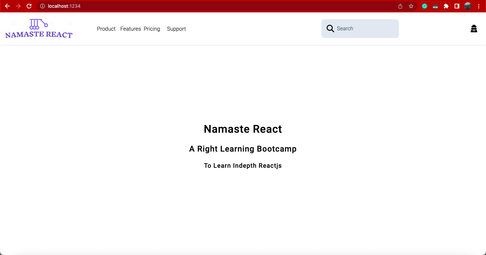

# Live Running Project



# QnA

### What is JSX?

It is a small extension to JavaScript. They are expressions that are transpiled to React Elements. Jsx helps us to avoid Reac.createElement nesting and write a beautiful and maintainable React Code.


### Superpowers of JSX?

-We can use JavaScript variables inside JSX using curly braces. Basically inside JSX we can evaluate/execute JavaScript using JSX.

-We can use string as attributes in JSX using '' or "".

-JSX escapes the attribute and children we pass to it. It is converted to string before getting rendered as HTML in browser.

-JSX is just an another way to write React.createElement, hence evaluate to React Elements, i.e., objects.


### What is "type" in script?

It is an attribute which can be provided to the script html tags.

-It is either omitted or a JS MIME type indicating the script is JavaScript. The links we provide in src, old browsers use MIME type to identify the respective programming language.

-If given as "module", JS treats as a JS Module. Its contents are deferred automatically.
-Any other value is treated as data-block, src attributed is ignored.


### {TitleComponent} vs {```<TitleComponent/>```} vs {```<TitleComponent></TitleComponent>```}?

-- TitleComponent is a React Function Component, i.e., Function returning JSX.

-- ```<TitleComponent/>``` is similar to React.createElement(TitleElement, null) and evaluates to a React Element.

-- ```<TitleComponent>Ajay</TitleComponent>``` is React.createElement(TitleElement, null, "Ajay") where "Ajay" is children in the respective React Element.
